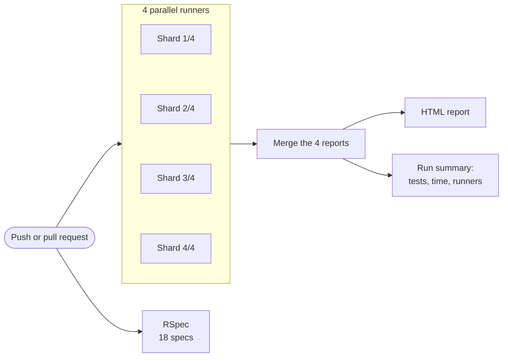

<div align="center">

# Hireflow E2E


A **Playwright (TypeScript) suite** for a small **multi-tenant Rails hiring app**, with a **FactoryBot seed endpoint**,
**saved sessions per role**, **email and SMS checks**, a **camera interview flow**, and **sharded CI**.

</div>

## 🎬 Demo

A real run of the end-to-end test. The recruiter builds a template and invites a candidate:


The candidate opens the email link, types the texted code, records both answers on camera and submits:


## 🎖️ Features

- **Tenant per worker, data per test**: runs never share data, even against one UAT database.
- **Saved sessions** for admin, recruiter and candidate.
- **Token-protected seed endpoint** in Rails, built on FactoryBot, never routed in production.
- **Email and SMS**: invitation emails, magic links and texted codes are read and acted on (Mailpit locally, Mailosaur-ready).
- **Camera and microphone** interview, using Chrome's fake-media flags.
- **Stable**: role-based locators, no fixed sleeps, 160 of 160 runs green with `--repeat-each=5`.
- **CI**: RSpec and four parallel Playwright runners on every push.

## ⚙️ How CI runs



Each runner starts its own stack (Rails in UAT mode, Mailpit, SMS sink) and runs 3 workers; each worker seeds its own tenant.

## 🔍 Where to look

| Topic | Link |
|---|---|
| Logged-in sessions for parallel tests | [`e2e/fixtures/index.ts` L33-67](e2e/fixtures/index.ts#L33-L67): tenant per worker (L33-43), one session per role (L45-61), handed to tests (L63-67). Sign-in: [`sessions.ts` L15-35](e2e/fixtures/sessions.ts#L15-L35) |
| Problems met there | One shared account let tests see each other's data: [`3161ab5`](https://github.com/goddivor/hireflow-e2e/commit/3161ab5) → [`4813841`](https://github.com/goddivor/hireflow-e2e/commit/4813841). Parallel sign-ins tripped the per-IP rate limit: [`7bc3569`](https://github.com/goddivor/hireflow-e2e/commit/7bc3569), [`4fb81de`](https://github.com/goddivor/hireflow-e2e/commit/4fb81de) |
| Flaky test fixes | Recorder announced "Recording…" too early, 16/20 failures: [`9a81206`](https://github.com/goddivor/hireflow-e2e/commit/9a81206). Email job ran before the transaction committed, 2/5 failures: [`7a30a4b`](https://github.com/goddivor/hireflow-e2e/commit/7a30a4b) |
| Email and SMS test | [`invite-candidate.spec.ts`](e2e/tests/invitations/invite-candidate.spec.ts): reads the email, follows the link, enters the texted code |
| CI runs | [A green run](https://github.com/goddivor/hireflow-e2e/actions/runs/35809339130): 32 tests on 4 parallel runners, count and runtime in its summary. [All runs](https://github.com/goddivor/hireflow-e2e/actions/workflows/e2e.yml) |
| Rails | [Seed controller](web/app/controllers/test_support/seeds_controller.rb), [factories](web/spec/factories), [seed specs](web/spec/requests/test_support/seeds_spec.rb) |

## 📦 Installation

Needs Docker and Node.js 20 or later.

```bash
git clone https://github.com/goddivor/hireflow-e2e.git && cd hireflow-e2e
npm ci && npx playwright install chromium
docker compose up -d --build --wait
npx playwright test
```

RSpec:

```bash
docker build -t hireflow-web-test --build-arg BUNDLE_WITHOUT="" --build-arg RAILS_ENV=test web
docker run --rm hireflow-web-test sh -c "bin/rails db:prepare && bundle exec rspec"
```
