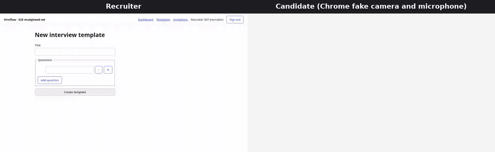

<div align="center">

# Hireflow E2E


A **Playwright suite in TypeScript** for **Hireflow**, a small **multi-tenant Rails hiring app** built alongside it.
Every worker seeds **its own tenant** through a **token-protected seed endpoint** built on **FactoryBot**,
keeps a **saved session per role** (admin, recruiter, candidate), reads **invitation emails and SMS codes**,
and drives a **camera and microphone interview** with Chrome's fake media devices. CI runs it **sharded across four runners**.



<sub>A real run of <code>e2e/tests/journeys/hiring-journey.spec.ts</code>, recorded by Playwright and rebuilt with <code>scripts/demo-gif.sh</code>.</sub>

</div>

## 🎖️ Features

- **Tenant per worker, data per test**: each Playwright worker seeds a fresh tenant named after the run id, and each test creates the records it asserts on, so workers, shards and concurrent runs against one shared UAT database never see each other's data.
- **Saved sessions per role**: admin, recruiter and candidate sessions are signed in once per worker, over HTTP, through the same forms a person uses; a test picks one with `test.use({ role })` and opens another actor with `pageAs(role)`.
- **Seed endpoint on FactoryBot**: `POST /test_support/tenants` and `POST /test_support/records` build data from the RSpec factories. The routes do not exist in production, and the endpoint answers 404 without the bearer token.
- **Email and SMS checks**: tests read invitation emails, magic links and texted one-time codes, then act on them. Mailpit and a local SMS sink stand in for the providers; a Mailosaur inbox is a drop-in behind the same interface.
- **Camera and microphone flow**: the candidate turns on the camera, records an answer per question with `MediaRecorder` and submits, headless, on Chrome's fake capture devices.
- **Stable by construction**: role-based locators only, no fixed sleeps, web-first assertions, and `expect.poll` for anything outside the page. The suite passes 160 of 160 runs with `--repeat-each=5` on six workers.
- **Sharded CI**: GitHub Actions runs RSpec, then the suite on four parallel runners, merges the reports into one HTML report, and writes the test count, wall time and runner count to the run summary.

## 📋 Requirements

- **Docker** with Compose v2, for the UAT stack: the Rails app, Mailpit and the SMS sink. Ruby is not needed on the host.
- **Node.js 20 or later** (CI uses 24) and npm, for the Playwright suite.
- **ffmpeg**, only to rebuild the demo GIF.

## 📦 Installation

```bash
git clone https://github.com/goddivor/hireflow-e2e.git
cd hireflow-e2e
npm ci
npx playwright install chromium
docker compose up -d --build --wait
```

The stack reads these variables. `docker-compose.yml` ships local defaults; CI generates fresh ones per run.

| Variable | Read by | Purpose |
|---|---|---|
| `SEED_TOKEN` | app, suite | Bearer token for the seed endpoint. Local default: `local-seed-token`. |
| `SECRET_KEY_BASE` | app | Rails session signing key for the `uat` environment. |
| `SIGN_IN_LIMIT_PER_IP` | app | Sign-ins per minute from one IP address (default 100, UAT 5000). |
| `SMTP_HOST`, `SMTP_PORT` | app | Where mail is delivered: Mailpit in UAT. |
| `SMS_GATEWAY_URL` | app | Where texts are delivered: the SMS sink in UAT. |
| `APP_HOST`, `DATABASE_PATH` | app | Host used in email links, and the SQLite file. |
| `BASE_URL` | suite | App under test (default `http://localhost:3000`). |
| `MAILPIT_URL`, `SMS_SINK_URL` | suite | Inbox APIs (defaults `http://localhost:8025`, `http://localhost:8026`). |
| `MAILOSAUR_API_KEY`, `MAILOSAUR_SERVER_ID` | suite | Optional. When both are set, emails are read from Mailosaur instead of Mailpit. |
| `E2E_RUN_ID` | suite | Names the tenants of a run. CI sets it to the workflow run id. |
| `E2E_WORKERS` | suite | Workers per runner (CI: 3). |

## ⚙️ Usage

### ▶️ Run the suite

```bash
npx playwright test                          # all 32 tests
npx playwright test e2e/tests/invitations    # one area
npx playwright test --repeat-each=20         # hunt for flaky tests
npx playwright test --shard=1/4              # what one CI runner does
npm run report                               # open the last HTML report
```

Mailpit's inbox is at <http://localhost:8025>; the texts the SMS sink received are at <http://localhost:8026/messages>.

### 🧪 Run the RSpec specs

```bash
docker build -t hireflow-web-test --build-arg BUNDLE_WITHOUT="" --build-arg RAILS_ENV=test web
docker run --rm hireflow-web-test sh -c "bin/rails db:prepare && bundle exec rspec"
```

### 🎬 Rebuild the demo GIF

```bash
./scripts/demo-gif.sh
```

### 🗂️ Layout

| Path | Contents |
|---|---|
| `e2e/fixtures/` | Tenant, saved sessions, `pageAs`, inboxes. Tests import `test` and `expect` from here only. |
| `e2e/support/` | Seed endpoint client, Mailpit, Mailosaur and SMS inboxes, unique data helpers. |
| `e2e/tests/` | One folder per area: `auth`, `team`, `templates`, `invitations`, `interview`, `journeys`. |
| `web/` | The Rails app. `RAILS_ENV=uat` is what the suite runs against. |
| `web/spec/` | RSpec specs and the FactoryBot factories shared with the seed endpoint. |
| `sms-sink/` | A 35-line HTTP stand-in for an SMS provider. |
| `.github/workflows/e2e.yml` | RSpec, four Playwright shards, merged report and run summary. |

## 🔍 Review guide

Direct links to the parts reviewers usually ask about.

**Logged-in sessions for parallel tests.**
[`e2e/fixtures/index.ts` lines 33 to 67](e2e/fixtures/index.ts#L33-L67): the worker-scoped `tenant` (L33-43), one saved session per role (L45-61), and the `role` option that hands a test its session (L63-67). The sign-in itself is [`e2e/fixtures/sessions.ts` lines 15 to 35](e2e/fixtures/sessions.ts#L15-L35).
Two problems met there, both fixed in the history:

- The first version shared one logged-in account across all workers, so tests saw each other's data and counts failed. Each worker now owns its account ([`3161ab5`](https://github.com/goddivor/hireflow-e2e/commit/3161ab5) then [`4813841`](https://github.com/goddivor/hireflow-e2e/commit/4813841)).
- Once every worker signed in two staff roles from the CI runner's single IP address, the per-IP sign-in rate limit tripped; each failed worker restarted and signed in again, which cascaded. The limit is now per email, with a separate per-IP limit that UAT raises ([`7bc3569`](https://github.com/goddivor/hireflow-e2e/commit/7bc3569), [`4fb81de`](https://github.com/goddivor/hireflow-e2e/commit/4fb81de)).

**CI run.** The [Actions tab](https://github.com/goddivor/hireflow-e2e/actions/workflows/e2e.yml): each run's summary shows the test count, wall time and the four parallel runners.

**Flaky tests, and what caused them.** Both were bugs in the app that a test exposed:

- [`9a81206`](https://github.com/goddivor/hireflow-e2e/commit/9a81206): the interview test failed 16 times out of 20. The page announced "Recording…" before `MediaRecorder` had produced any data, so a quick Stop uploaded an empty file. Stop now appears with the first chunk; 30 out of 30 passes.
- [`7a30a4b`](https://github.com/goddivor/hireflow-e2e/commit/7a30a4b): the invitation test timed out on the email in 2 of 5 full runs. `deliver_later` ran inside a transaction, so the job sometimes looked for the magic link before the commit and dropped the email. The job is now enqueued after the commit; 60 out of 60 passes.

**Email and SMS test that acts on the message.**
[`e2e/tests/invitations/invite-candidate.spec.ts`](e2e/tests/invitations/invite-candidate.spec.ts) reads the invitation email, follows its magic link, reads the texted code and types it in.
[`e2e/tests/auth/magic-link.spec.ts`](e2e/tests/auth/magic-link.spec.ts) follows sign-in links and checks that each works only once.

**Rails.**
The seed controller [`web/app/controllers/test_support/seeds_controller.rb`](web/app/controllers/test_support/seeds_controller.rb), the factories in [`web/spec/factories/`](web/spec/factories), and the specs [`web/spec/requests/test_support/seeds_spec.rb`](web/spec/requests/test_support/seeds_spec.rb) and [`web/spec/requests/invitations_spec.rb`](web/spec/requests/invitations_spec.rb).
